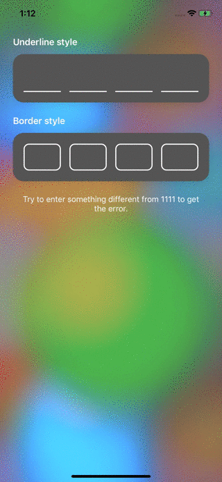

[](https://travis-ci.com/Sunspension/VKPinCodeView)

[](https://img.shields.io/cocoapods/v/VKPinCodeView.svg)
[](https://github.com/Carthage/Carthage)
[](https://docs.swift.org/package-manager/PackageDescription/PackageDescription.html)

## Features

- [x] Variable PIN length
- [x] Underline, border and custom styles
- [x] The error status with / without shake animation
- [x] Resetting the error status manually, by user interaction or automatically with a custom delay
- [x] Highlighting the selected entry with / without animation
- [x] Text input callbacks (begin editing, change code, complete)
- [x] Text input validation
- [x] LTR/RTL support


## Preview



## Installation

### CocoaPods

[CocoaPods](https://cocoapods.org) is a dependency manager for Cocoa projects. For usage and installation instructions, visit their website. To integrate `VKPinCodeView` into your Xcode project using CocoaPods, specify it in your `Podfile`:

```ruby
pod 'VKPinCodeView'
```

### Carthage

[Carthage](https://github.com/Carthage/Carthage) is a decentralized dependency manager that builds your dependencies and provides you with binary frameworks. To integrate `VKPinCodeView` into your Xcode project using Carthage, specify it in your `Cartfile`:

```ogdl
github "Sunspension/VKPinCodeView"
```

### Manually

Just copy and paste Source folder into your project. 


## Minimal Setup

```swift
override func viewDidLoad() {
   super.viewDidLoad()
        
   let pinView = VKPinCodeView()
   pinView.translatesAutoresizingMaskIntoConstraints = false
   view.addSubview(pinView)
   pinView.leadingAnchor.constraint(equalTo: view.leadingAnchor, constant: 40).isActive = true
   pinView.trailingAnchor.constraint(equalTo: view.trailingAnchor, constant: -40).isActive = true
   pinView.centerYAnchor.constraint(equalTo: view.centerYAnchor).isActive = true
   pinView.heightAnchor.constraint(equalToConstant: 50).isActive = true
   pinView.onSettingStyle = { UnderlineStyle() }
   pinView.becomeFirstResponder()
}
```

## Contribute

VKPinCodeView is open to contribute, see contribution notes.
- If you want to contribute, submit a pull request
- If you found a bug, open an issue.
- If you need help with a feature or need to disscuss something else please contact me vladimir.kokhanevich@gmail.com


## Requirements

- iOS 9.0+ 
- Xcode 10.2+
- Swift 5.0

## Author

Made with :heart: by Vladimir Kokhanevich


## License

VKPinCodeView is released under the MIT license. [See LICENSE](https://github.com/Sunspension/VKPinCodeView/blob/master/LICENSE) for details.
